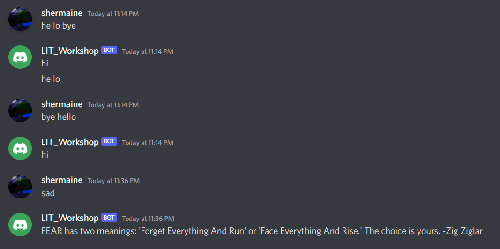

# Tech Week 2022
Discord Bot built with Python
- when hello exists in message, the bot will reply with hi.
- when the message starts with hello, the bot will reply with hello.
- a list of sad words will be preset, to trigger the bot.
- when a sad message from the list is sent, it will randomly generate a quote from the passed api and the bot will send the quote into the server. 

Date: Auguest 2022 <br/>
Technologies Used: Python <br/>
Libraries used: discord, python-dotenv, requests



### Running the Project
Run the following commands in terminal/command prompt
```
pip install discord==2.0.0
pip install python-dotenv==0.20.0
pip install requests==2.28.1
OR
pip install -r requirements.txt
```
In your .env file, copy the following and add your variables
```
DISCORD_TOKEN = ''
```
### Requirements
- Discord Developer 
- Python Platform
- A new server if you want to test the bot separately 

### Starting a virtual environment
```
python -m venv .venv
# change your python interpreter
```